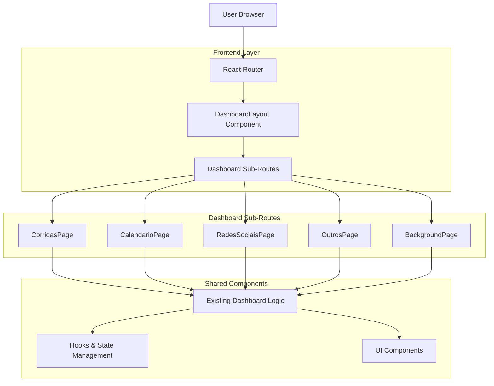
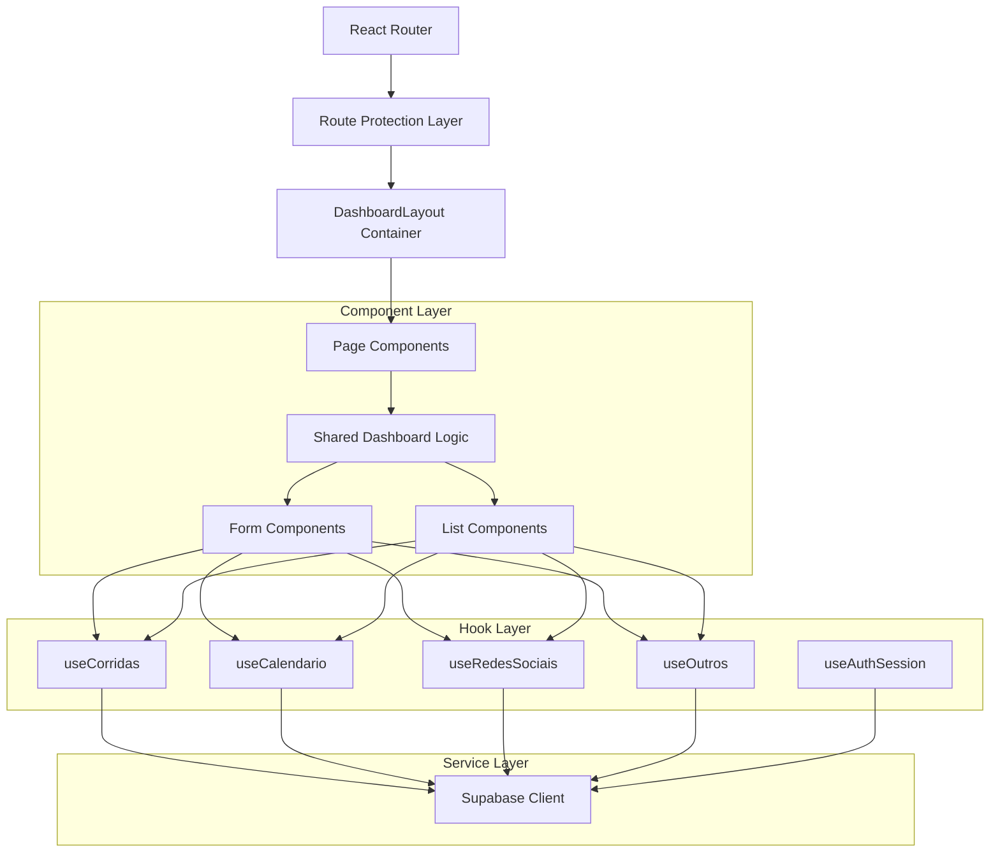
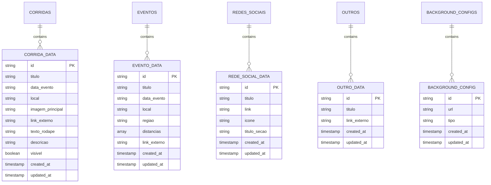

# Documento de Arquitetura Técnica - Sistema de Roteamento Hierárquico Dashboard

## 1. Arquitetura de Design



## 2. Descrição da Tecnologia

- **Frontend:** React@18 + React Router@6 + TypeScript + Tailwind CSS + Vite
- **Backend:** Supabase (mantém configuração atual)
- **Autenticação:** Supabase Auth (via ProtectedRoute)

## 3. Definições de Rotas

| Rota | Propósito |
|------|-----------|
| `/dashboard` | Layout principal, redireciona para `/dashboard/corridas` |
| `/dashboard/corridas` | Página de gerenciamento de corridas |
| `/dashboard/calendario` | Página de eventos do calendário |
| `/dashboard/rede-sociais` | Página de configuração de redes sociais |
| `/dashboard/outros` | Página de outros conteúdos |
| `/dashboard/background` | Página de upload de backgrounds (desktop apenas) |

## 4. Definições de API

### 4.1 APIs Principais

O sistema mantém todas as APIs existentes sem modificações:

**Corridas**
```typescript
// Hooks existentes mantidos
const { loading, criarCorrida, editarCorrida, excluirCorrida, buscarCorridas, toggleVisibilidade } = useCorridas();
```

**Calendário**
```typescript
// Hooks existentes mantidos  
const { loading, criarEvento, editarEvento, excluirEvento, buscarEventos } = useCalendario();
```

**Redes Sociais**
```typescript
// Hooks existentes mantidos
const { loading, criarRedeSocial, editarRedeSocial, excluirRedeSocial, buscarRedesSociais } = useRedesSociais();
```

**Outros**
```typescript
// Hooks existentes mantidos
const { loading, criarOutro, editarOutro, excluirOutro, buscarOutros } = useOutros();
```

## 5. Arquitetura do Servidor



## 6. Modelo de Dados

### 6.1 Definição do Modelo de Dados

O sistema mantém todos os modelos de dados existentes sem alterações:



### 6.2 Linguagem de Definição de Dados

O sistema mantém todas as tabelas existentes do Supabase sem modificações. Não são necessárias alterações no banco de dados para implementar o roteamento hierárquico.

## 7. Implementação Técnica

### 7.1 Estrutura de Componentes

```typescript
// Novo componente DashboardLayout
interface DashboardLayoutProps {
  children: React.ReactNode;
}

// Componentes de página extraídos do Dashboard atual
interface CorridasPageProps {}
interface CalendarioPageProps {}
interface RedesSociaisPageProps {}
interface OutrosPageProps {}
interface BackgroundPageProps {}
```

### 7.2 Configuração de Rotas

```typescript
// App.tsx - Nova configuração de rotas
<Route path="/dashboard" element={
  <ProtectedRoute>
    <DashboardLayout />
  </ProtectedRoute>
}>
  <Route index element={<Navigate to="/dashboard/corridas" replace />} />
  <Route path="corridas" element={<CorridasPage />} />
  <Route path="calendario" element={<CalendarioPage />} />
  <Route path="rede-sociais" element={<RedesSociaisPage />} />
  <Route path="outros" element={<OutrosPage />} />
  <Route path="background" element={<BackgroundPage />} />
</Route>
```

### 7.3 Migração de Estado

```typescript
// Substituir activeSection state por useLocation
const location = useLocation();
const currentSection = location.pathname.split('/').pop() || 'corridas';

// Navegação via React Router
const navigate = useNavigate();
const handleSectionChange = (section: string) => {
  navigate(`/dashboard/${section}`);
};
```

## 8. Plano de Implementação

### 8.1 Fase 1: Preparação
1. Criar componente `DashboardLayout`
2. Extrair lógica de cada seção em componentes separados
3. Configurar novas rotas no `App.tsx`

### 8.2 Fase 2: Migração
1. Substituir sistema de abas por navegação baseada em URL
2. Migrar estado `activeSection` para `useLocation`
3. Atualizar navegação para usar `useNavigate`

### 8.3 Fase 3: Testes
1. Verificar funcionamento de todas as sub-rotas
2. Testar deep links e navegação direta
3. Validar responsividade em mobile
4. Confirmar preservação de funcionalidades existentes

### 8.4 Fase 4: Otimização
1. Implementar lazy loading se necessário
2. Adicionar breadcrumbs se desejado
3. Otimizar performance de navegação